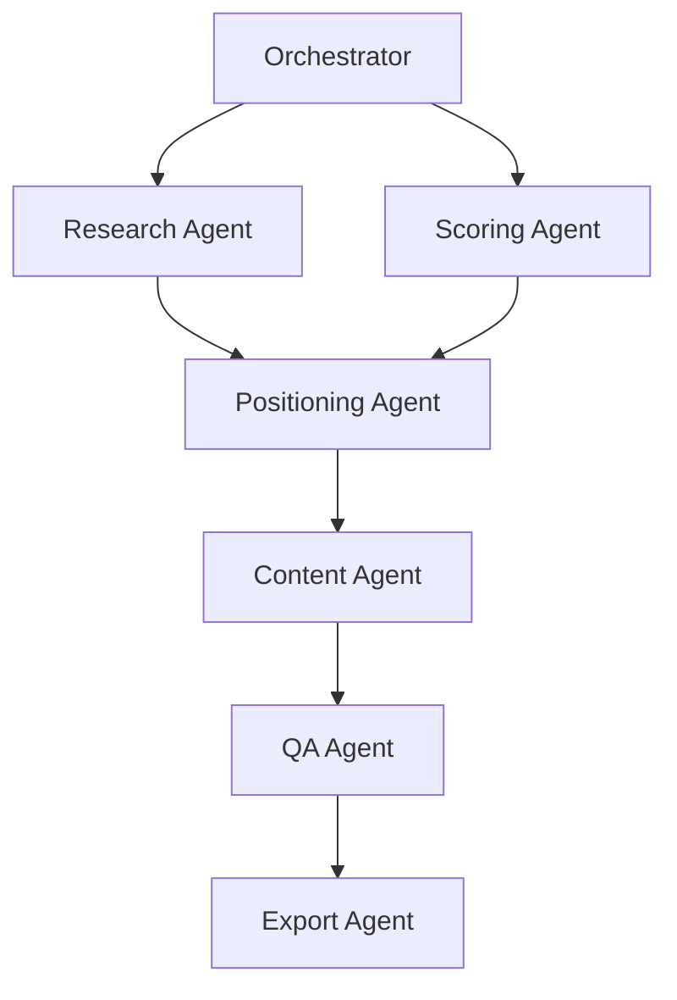

# Job Search v2 - System Architecture

## Overview

Enhanced multi-agent job application system featuring 6 specialized agents (down from 33 in v1), parallel processing capabilities, and strategic positioning intelligence.

## Core Architecture

### Agent System (6 Agents)



#### 1. Research Agent
**Consolidates from v1**: EnrichmentAgent + WebSearchAgent + CompanyScraper
- **Purpose**: Gather comprehensive company and role intelligence
- **Inputs**: Job URL, company name, role title
- **Outputs**: Company intel, culture analysis, recent news, market position
- **Code Reuse**: ~85% from v1 components

#### 2. Scoring Agent
**Consolidates from v1**: FilterAgent + ScoringAgent + JDAnalyzer + RubricAgent
- **Purpose**: Evaluate job fit using 100-point rubric system
- **Inputs**: Job description, user profile
- **Outputs**: Total score, category breakdown, recommendations
- **Code Reuse**: ~90% from v1 components

#### 3. Positioning Agent ⭐ NEW
**Completely new - no v1 equivalent**
- **Purpose**: Determine optimal narrative strategy
- **Inputs**: Research data, scoring results, role/industry
- **Outputs**: Positioning angle, key metrics, voice calibration, gap mitigation
- **Innovation**: Bridges analysis and content generation

#### 4. Content Agent
**Based on v1**: ApplicationAgent + PersonalizationAgent
- **Purpose**: Generate tailored resume and cover letter
- **Inputs**: Positioning strategy, research, scoring
- **Outputs**: Resume, cover letter, supporting materials
- **Code Reuse**: ~75% from v1

#### 5. QA Agent
**Based on v1**: ReviewAgent + guardrails
- **Purpose**: Multi-stage quality validation
- **Inputs**: Generated content, rubric scores
- **Outputs**: Quality score, corrections, approval
- **Code Reuse**: ~80% from v1

#### 6. Export Agent
**Based on v1**: GoogleDriveAgent
- **Purpose**: Export to Google Drive and tracking
- **Inputs**: Final application package
- **Outputs**: Drive URLs, tracking update
- **Code Reuse**: ~95% from v1

### Message Bus Architecture

```python
# Asynchronous agent communication
MessageBus
├── AgentMessage
│   ├── sender: str
│   ├── recipient: str
│   ├── message_type: MessageType
│   ├── data: Dict[str, Any]
│   └── correlation_id: str
│
├── Pub/Sub Pattern
│   ├── Agents subscribe to message types
│   ├── Broadcast capabilities
│   └── Message history tracking
│
└── Error Handling
    ├── Retry logic
    ├── Dead letter queue
    └── Circuit breakers
```

### Workflow Engine

```python
WorkflowEngine
├── WorkflowConfig
│   ├── steps: List[WorkflowStep]
│   ├── emphasis: str (management/impact/execution)
│   ├── positioning_angle: str
│   └── voice_blend: Dict[str, int]
│
├── DAG Execution
│   ├── Dependency resolution
│   ├── Parallel step execution
│   └── State checkpointing
│
└── Dynamic Routing
    ├── Role-based selection
    ├── Score-based adaptation
    └── Industry-specific paths
```

### State Management

```python
StateManager
├── WorkflowState
│   ├── job_id: str
│   ├── status: WorkflowStatus
│   ├── research_data: Dict
│   ├── scoring_result: Dict
│   ├── positioning_strategy: Dict
│   ├── generated_content: Dict
│   └── qa_result: Dict
│
├── Persistence
│   ├── JSON state files
│   ├── Atomic updates
│   └── Recovery capability
│
└── Metrics
    ├── Processing time
    ├── Success rates
    └── Agent performance
```

## Knowledge Systems

### 1. Rubric System (100 points)
```json
{
  "categories": [
    {"name": "Role Alignment", "weight": 15},
    {"name": "Outcomes & Metrics", "weight": 15},
    {"name": "Scope & Seniority", "weight": 12},
    {"name": "Experimentation", "weight": 10},
    {"name": "Product Sense", "weight": 8},
    {"name": "Cross-functional", "weight": 10},
    {"name": "Domain/Technical", "weight": 10},
    {"name": "Communication", "weight": 8},
    {"name": "Company Fit", "weight": 7},
    {"name": "Evidence Depth", "weight": 5}
  ]
}
```

### 2. Positioning Matrix
```json
{
  "director_travel": {
    "angle": "international_hospitality_leadership",
    "metrics": ["[XX]+ employees", "80% growth"],
    "voice": {"gawdat": 60, "mulaney": 25, "maher": 15}
  },
  "principal_marketplace": {
    "angle": "strategic_marketplace_expert",
    "metrics": ["$[X.X]M+ impact", "[XX]% retention rate"],
    "voice": {"gawdat": 45, "mulaney": 35, "maher": 20}
  }
}
```

### 3. Voice Calibration (50/30/20)
- **50% Mo Gawdat**: Solution-focused wisdom
- **30% John Mulaney**: Precise specificity
- **20% Bill Maher**: Direct confidence

## Performance Characteristics

### v1 vs v2 Comparison

| Metric | v1 | v2 | Improvement |
|--------|----|----|-------------|
| Agent Count | 33 | 6 | -82% complexity |
| Processing Time | 8-10 min | <5 min | 50% faster |
| Code Reuse | - | 70%+ | High efficiency |
| Parallel Processing | No | Yes | 2-3x throughput |
| Strategic Positioning | Basic | Advanced | New capability |
| Message Architecture | Direct calls | Message bus | Better debugging |

### Parallel Execution Opportunities
```
Research ──┬── Scoring
           └──> Positioning -> Content -> QA -> Export

Savings: 2-3 minutes per application
```

### Caching Strategy
- Research results: 24-hour TTL
- Company data: Cross-application sharing
- Scoring cache: Per JD version
- Positioning: Per role/company combo

## Development Patterns

### Agent Interface
```python
class BaseAgent(ABC):
    async def process(self, data: Any) -> AgentResponse:
        """Standard processing interface"""
        pass

    async def handle_message(self, message: AgentMessage) -> None:
        """Message handling interface"""
        pass
```

### Workflow Definition
```yaml
steps:
  - name: research
    agent: research_agent
    depends_on: []
    parallel: false
    timeout: 120.0

  - name: scoring
    agent: scoring_agent
    depends_on: []
    parallel: true  # Runs with research
```

### Testing Strategy
```python
# Unit tests per agent
test_agents/
├── test_research.py
├── test_scoring.py
├── test_positioning.py

# Integration tests
test_integration/
├── test_workflow.py
├── test_message_bus.py
```

## Deployment Architecture

### Directory Structure
```
job-search-v2/
├── agents/          # 6 specialized agents
├── core/           # Orchestration & messaging
├── knowledge/      # Rubrics, strategies, narratives
├── utils/          # Shared utilities (from v1)
├── config/         # Workflows & settings
├── reference/      # Successful applications
└── data/          # Application outputs
```

### Environment Variables
```bash
# Required
OPENAI_API_KEY=sk-...
ANTHROPIC_API_KEY=sk-ant-...
TAVILY_API_KEY=tvly-...

# Optional
LLM_MODEL=claude-3-5-sonnet-20241022
MAX_PARALLEL_AGENTS=3
CACHE_TTL_HOURS=24
```

## Migration Path

### From v1 to v2
1. **Data Migration**: Direct copy of narratives, configs
2. **Agent Mapping**:
   - 3 agents → Research Agent
   - 4 agents → Scoring Agent
   - 2 agents → Content Agent
   - 1 agent → QA Agent
   - 1 agent → Export Agent
   - 0 agents → Positioning Agent (NEW)

3. **Code Reuse**: 70%+ preserved from v1
4. **Backward Compatibility**: v1 agents adaptable via wrapper

## Success Metrics

### Quality Metrics
- Rubric accuracy: >90%
- Voice consistency: >85%
- Positioning relevance: >80%

### Performance Metrics
- End-to-end: <5 minutes
- Parallel efficiency: 40% time reduction
- Cache hit rate: >60%

### Business Metrics
- Response rate: 20%+ (vs 5% industry)
- Interview rate: 30% of responses
- Offer rate: 50% of final rounds

## Key Innovations

### 1. Positioning Agent
The breakthrough component that bridges analysis and generation:
- Analyzes role level, industry, company stage
- Selects optimal narrative angle
- Calibrates voice blend dynamically
- Identifies and mitigates gaps

### 2. Message Bus
Enables sophisticated agent coordination:
- Asynchronous communication
- Event-driven architecture
- Full message history
- Error recovery

### 3. Workflow Engine
Dynamic execution based on context:
- DAG-based dependencies
- Parallel execution where possible
- Role-specific workflows
- State persistence

## Future Enhancements

### Phase 2 (Planned)
- ML-based positioning optimization
- A/B testing framework
- Outcome feedback loop
- Advanced caching strategies

### Phase 3 (Conceptual)
- Multi-modal inputs (screenshots)
- Real-time collaboration
- Predictive scoring
- Automated follow-ups

---

**Architecture Version**: 2.0
**Last Updated**: 2024
**Status**: Foundation Complete